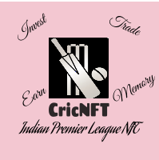

## Overview
**CricNFT**, is a fully decentralized application to allow any sports to be tokenized. This prototype demonstrates how an 'Indian Premier League' (IPL) team owner can **create NFTs in just two simple steps** and how cricket fans all over the world can be part of their favorite IPL team by **minting those NFTs**. 
In addition, the dApp also **incentivizes** NFT holders of the winning team for that season. IPL team owners can collect funds generated by their team’s NFT sale.
It has its own **marketplace** to allow easy buying/selling of NFTs by providing interface to Opensea platform. 

[Chainlink Hackathon](devpost url) project.

Video Presentation (url).

**GitHub links**
* CricNFT -> https://github.com/ShivaliLN/CricNFT.git
* CricNFT Marketplace -> https://github.com/ShivaliLN/CricNFT-marketplace.git

## Inspiration
Cricket is like a 'religion' in India. Similarly, every country has their favorite sports. 
Over the past year, NFTs have evolved from being simple collectibles to offer highest expressions, something that is incredibly valuable, aesthetically beautiful, of high artistic merit, and physically present in the society. 

CricNFT provides a platform to have digital ownership and way to support your favorite team. Currently, there is no such platform that is fully decentralized.

**Disclaimer** : This project is a proof of concept. The full-blown application is on the roadmap.

## What it does
CricNFT provides curated NFT platform for minting NFT's of your favorite IPL team. Team owners who create agreement can withdraw funds generated from their team's NFT sale. In addition, 1% funds from every NFT purchase goes to the contract's pool and locked in decentralized contract and can be claimed by NFT holders of the winning team for a season.

## How it works
The users of this dApp can be categorized as below:
* **Sport's Team Owner** - For this prototype, these users are referred as 'IPL Team Owner'
* **General Public** - For this prototype, these users are referred as 'fans'

### Interface for Sport's Team Owner

* **Step 1 - Create Agreement** 
Once the IPL team owner connects with their authorized published address to the dApp, this page presents them with a form to input data as below:

    a. IPL Team Id -                Published team id to retrieve data from external data providers using Chainlink API
    b. Total Number of NFT -        Number of NFTs that can be minted for a season
    c. Price Per NFT (ETH/MATIC) -  Amount that user has to pay to mint the NFT (excluding gas)
    d. IPL Season ID -              For example, IPL season 2021 the Id is '708' and used to retrieve match-results from external API like SportsMonk

    'Create Agreement' button creates an agreement with 'CricNFTTeamAgreement' contract and Token Id is generated. 
    **Note**: Currently, contract 'owner' grants the team owners access to allow them create the agreement. But, idea is to have the IPL Team Owner's ethereum addresses published and read from external APIs to authenticate.

* **Step 2 - Upload Metadata and Add Token**
Once the IPL team owner has created the agreement, Chainlink keepers will perform upkeep to bring the required data from external API. 
The data will be used as 'properties' for the NFTs (like IPL Team Name, all team players names etc).
This page presents them with another small form to input data as below:

    a. Token ID -                   This is the Token Id generated in the step 1 to be associated to the NFT
    b. IPL Team Name -              This is an input by the owner currently but once the endpoint is setup it can be retrieved by the external API
    c. Image IPFS/Filecoin URL -    This is the IPFS/Filecoin image URL to be associated with the NFT. This is an input field for now but will be changed to facilitate
                                    owner to upload the image directly from this interface and use that CID programmatically.

    'Add Token' button uploads the 'dynamically generated' metadata JSON file to IPFS/Filecoin and adds the 'Token Id' to 'CricNFTMint' contract to allow minting by the general public.

### Interface for General Public
* **MarketPlace** 
    Once the step 1 and 2 are done by the team owner, the NFTs are now available for minting. 
    Navigate to the Marketplace URL. 

    CricNFT Marketplace:
    On this page,  all available NFTs and their token ids and rates are listed. 
    Fans can mint the NFTs by providing the Token Id and Quantity they wish to mint. 

    **Note** : For fair distribution of NFTs, one address can only mint upto 25 NFTs for a given token id.

    Moralis OpenSea Clone Plugin
    On this same page using Moralis Opensea clone you can easily Get Asset, Get Order, Create Buy Order, Create Sell Order by providing the 'CricNFTMint' contract address and Token Id.

* **Withdraw or Claim Share** 
    This page allows 
    * Winning team's NFT holders to claim their share from the contract's pool that was generated using 1% of purchase for each NFT that was minted by the contract.
    * IPL Team Owners can withdraw funds generated from total number of their team's NFT minted. 

    'Claim Share' button determines the balance of winning team's NFT for the connected address and transfers the value.  
    'Withdraw' button transfers the funds from contract to the IPL team onwer.

## How I built it 
**CricNFT** is comprised of 3 contracts deployed on the blockchain and leverages Chainlink Keepers and any API features. 
This dApp is built on Moralis using features like moralis-react, web3, authentication, event logging, cloud functions, IPFS file save to store and request the token metadata. In addition, using Moralis Opensea Plugin for easy interface with OpenSea. 

CricNFT Architecture
* **Contracts on blockchain** 
    The three contracts are as below:

    * CricNFTTeamAgreement : This is the step 1 contract used by team owner to create an agreement.

    * CricNFTGetAPIData    : This can be considered as step 1.a.  

    * CricNFTMint          : This is the step 2 contract to add token and allow ERC1155 token minting and claiming share. 

* **Chainlink Keepers and API** 
The chainlink keepers checks if there is any new agreement created in 'CricNFTTeamAgreement' contract. If yes, performs upkeep by retrieving data using Chainlink API. 
This data is stored on the blockchain for each token id to be used by the application to programmatically generate the JSON file structure for metadata. This data is assigned as 'properties' of the token. 
**Note** 
   * SportsMonk does provide oracle to get the IPL 'match-results' and 'toss-results' but currently there is no adapter/endpoint to get the data for teams information like player names, team name etc. I reached out to the team to implement the endpoint but the timeline did not fit for the hackathon submission.
   * So, as a proof of concept, the data retrieved is from SportsData.IO for soccer. Meanwhile, working on setting up the oracle/endpoint for IPL team related data. I have subscribed to their site and following the Chainlink tutorials to run your own Node.

* **Moralis** 
This dApp is built using Moralis and really stands with their vision of cutting the development time.
    
   * Moralis Server together with the Moralis SDK, allowed to quickly and easily connect the front-end with my contracts and execute contract functions.
   * Authenticate users connecting via Metamask.
   * Create tables to store the event logging. 
   * Using cloud functions, I use the data from these events to dynamically display the available NFTs for minting on the CricNFT MarketPlace along with their rate and token id information.
   * Using saveIPFS method to create runtime JSON files and upload them on IPFS/Filecoin.
   * One of the best features is the Moralis OpenSea Clone plugin to allow my dApp to have its own Marketplace. 
   **Note** For now, OpenSea Clone is for proof of concept as the plugin is only available for Mainnet and Rinkeby and my contracts are deployed on Polygon Mumbai testnet and Kovan testnet as chainlink keepers are available there.

* **IPFS/Filecoin** 
    * All the NFT images are stored on IPFS/Filecoin
    * The metadata JSON files are uploaded using Moralis saveIPFS() method.

* **Alchemy Endpoint** 
    * Registered with Alchemy to connect to Polygon, Kovan testnets using their endpoint URLs.

* **ENS**
    * For sample, registered ENS on testnest for one of the IPL Team i.e mumbaiindians.test. 
    Not integrated with the dApp yet as reserving ENS is only available on Rinkeby testnet and my dAPP is deployed on Polygon and Kovan.

## Challenges I ran into
* Unexpectedly had to drop the original idea that I began the hackathon with.
* The UI developed is by a backend developer attempting front-end for the first time using react.

## Accomplishments that I am proud of
* While we were halfway in the hackathon, since the original idea for project was dropped, instead of quitting the hackathon came up with this new idea. In just two days finalized the concept and design. 
* Did 'on-the-job' React learning to design my dApp
* First time integrated with Moralis
* Solo developer to build the prototype in a short span

## What I learned
* Learned new concepts for solidity smart contract and working with ERC1155
* How to create my own Node and external adapter which I will continue working on after this hackathon
* Beginner level React
* How to use Moralis

## Roadmap
* Complete the remaining open items like, oracle implementation for IPL data etc
* In marketplace, dynamically show the NFT image from converting hex to base58 string to get the IPFS hash. 

## Technical details
* Polygon Testnet Deployed Contracts
    * CricnftTeamAgreement Contract deployed to: https://mumbai.polygonscan.com/address/0x31810884311A857c827f8f354c3724f5397FF6b3
    * CricNFTGetAPIData Contract deployed to: https://mumbai.polygonscan.com/address/0xA089B7AEb2fb4E9D5Fb193980e2940cfF59AADa6
    * CricNFTMint Contract deployed to: https://mumbai.polygonscan.com/address/0x501D0799131003e16089e881C5Bfe3073C2a8bC5

* Keepers
    * https://keepers.chain.link/mumbai/133

* Run test scripts
    npx hardhat test

# Run on local
    * cd frontend/src
    * yarn start

* For CricNFT Marketplace
    * yarn start

